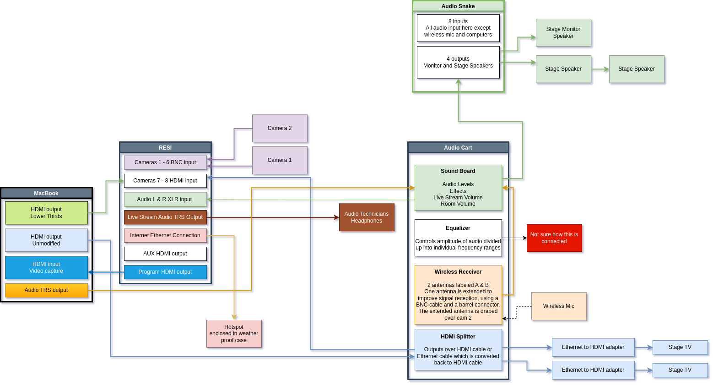
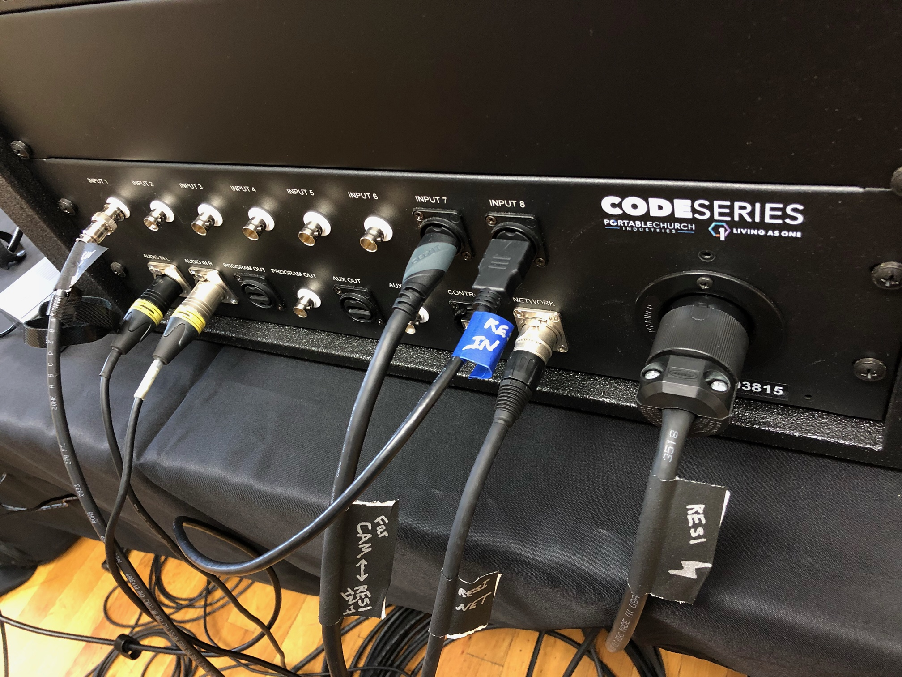

# MCC Tech Documentation

Documentation of the AV system used by Multiply Christian Church to host a service and stream it live to social media

Research Markdown syntax to learn how to modify files such as this `README.md` file.

Navigate to [draw.io](https://draw.io) to modify `*.drawio` files such as the main diagram.
Export the modified diagram to an image format and link to it in the `README.md` to update it here.

The MacBook has two HDMI outputs, one HDMI input, and one audio jack (TRS or tip ring sleave) output:

* One HDMI output is the raw, unmodified output.
It is displayed on the side stage TVs and can be used as slides on the live stream.
It’s fed into the HDMI splitter (mounted at the bottom of the audio cart) via a flat HDMI cable labeled “Computer”.
That same feed is returned from the audio cart via a flat HDMI cable, which is labeled “RESI”.
Plug it into either INPUT 7 or INPUT 8.

* The other HDMI output is for the “lower third” (only has lyrics positioned in the lower third of the screen).
It feeds directly into the RESI through either INPUT 7 or INPUT 8.
Any HDMI cable can be used route the feed.

* HDMI Input is for video capture or recording:
Use the Video Capture USB dongle.
Record use [OBS Studio](https://obsproject.com/) which should already be installed on the MacBook.
Plug into `PROGRAM OUT`.
Confirm `PROGRAM OUT` is working, as it has not been working previously.
If `PROGRAM OUT` is not working, plug into `AUX OUT` instead.
From the RESI settings, setting AUX source to `PROGRAM`.

* Audio output
Videos played on the MacBook need the audio sent to the audio cart.

RESI settings:
* Set down stream key 1 ( aka DSK 1) cut and fill to the feed with the lower third feed.
  See the red highlight in the attached picture of the RESI board.

Or here:
* Turn off “Pre Multiplied Key”
* Setting `Clip` and `Gain` to `0%`.

If you want to stop there, that would be enough to get lyrics running when needed. To bring lyrics up hit “DSK 1 Auto” circled in black in the first picture.

If you want to add a black background to lyrics, here are the settings I use:

Clip and gain only show if the pre multiplied Key is off.

If you want to try Picture in Picture (“DVE # PIP” circled in yellow in the first picture) here’s what I figured out very recently:
* Hitting one of the PIP buttons displays the PIP in preview and “ties” it to the next transition.
* To remove PIP hit “Background” circled in purple here

* If something has “tie” set, it means that setting is tied to the next transition. Hitting “Auto”, circled in blue, will cause the tied effect to go from “Preview” view  to “Program” view. It can also go from “Program” view to “Preview” view depending on where the effect starts from.

